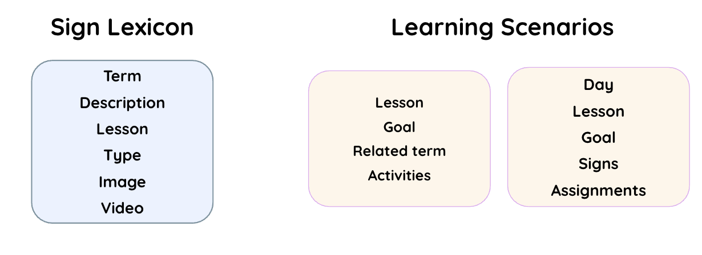
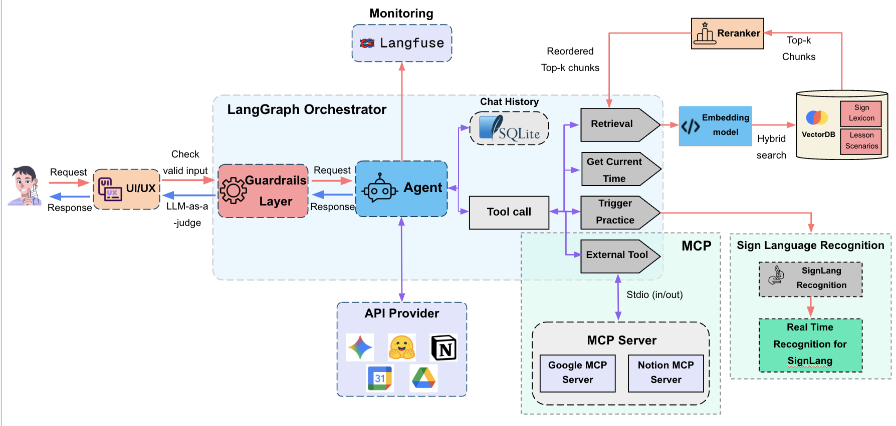
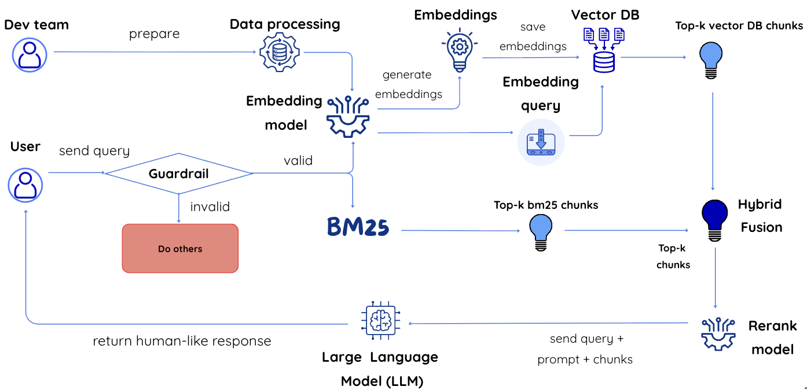
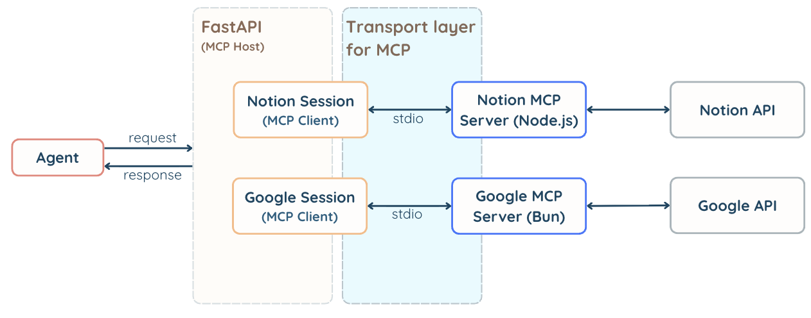
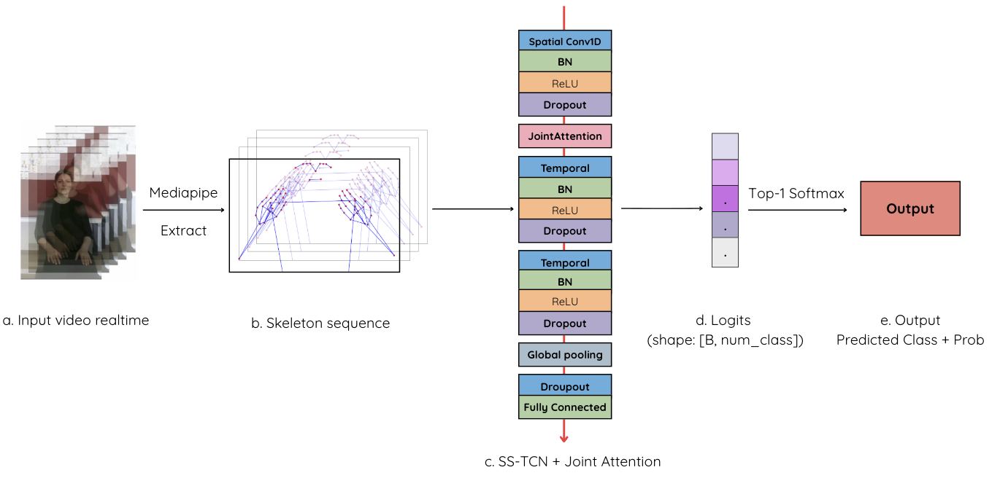
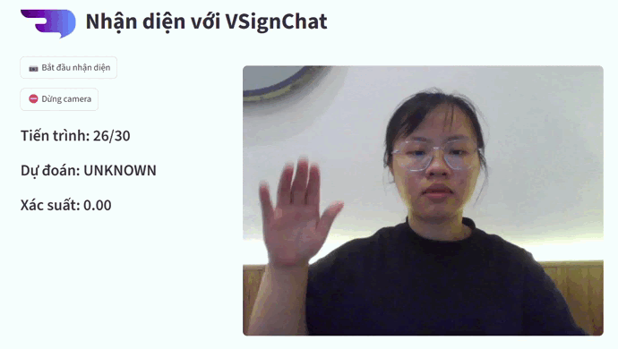
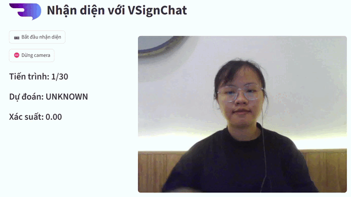
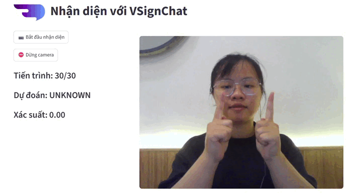
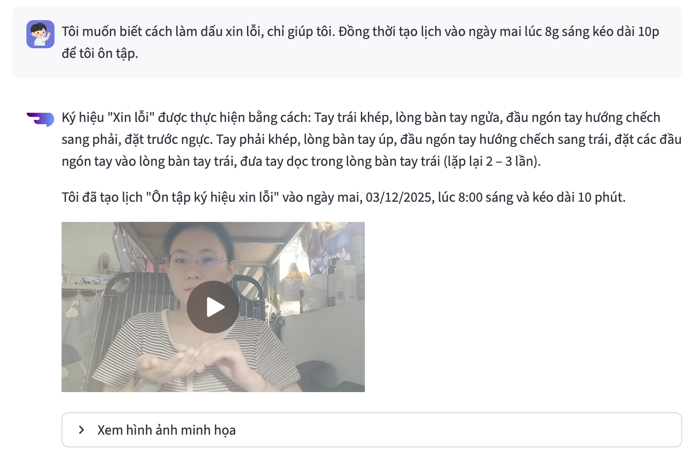

# VSignChat - Intelligent Sign Language Recognition System and Learning Assistant for the Deaf

<br>

VSignChat is a comprehensive system combining real-time Vietnamese Sign Language (VSL) recognition and a virtual learning assistant aimed at the deaf community. The system stands out with 4 core functionalities: **Q&A**, **Recommendation**, **Recognition**, and **Automation**.

---

## 📊 1. Data Extraction


The dataset is directly extracted from the official sign language textbook authored by **Trần Thị Thiệp** (Deputy Head of the Special Education Department, Head of the Education for Deaf and Language-Impaired Children at Hanoi National University of Education). 

It provides a rich and high-quality vocabulary dataset covering basic vocabulary, simple communication sentences, and common signs, focusing on:

<ul style="margin-top: 10px;">
  <li><b>102 selected signs (labels)</b>.</li>
  <li><b>Over 104 videos per sign</b> (Including ~90 videos for the training set and ~14 videos for the test set).</li>
  <li>The main data sources are divided into: <b>Sign Lexicon</b> and <b>Learning Scenarios</b>.</li>
</ul>

<br clear="all">


<p align="center">
  
</p>
---

## 🏗️ 2. Main Architecture

VSignChat integrates advanced technologies for natural language processing and human body movement sequence analysis:

<p align="center">
  
</p>

### RAG System (Retrieval-Augmented Generation)
To optimize accuracy and learning context search capabilities, the system applies RAG techniques with:
*   **Hybrid Search**: Combining BM25 and Vector Search (Using the `bkai-foundation-models/vietnamese-bi-encoder` model).
*   **Rerank**: Improving result rankings using `BAAI/bge-reranker-base`.

<p align="center">
  
</p>

### Model Context Protocol (MCP)
The system utilizes MCP external tools for seamless interaction with third-party applications. Thanks to this, the Agent can:
*   Automatically extend through **Google Workspace** (Calendar, Drive) to schedule classes and download documents.
*   Manage memory and lesson notes via the **Notion** MCP Server.

<p align="center">
  
</p>

---

## 🤖 3. Sign Language Recognition Model (SS-TCN)

The core of sign language recognition uses the **Separable Spatial-Temporal Convolution Network (SS-TCN)** structure combined with an Attention mechanism:

*   **Input**: Skeleton coordinate sequence extracted from video via Mediapipe (Dimensions: 3 channels x 30 frames x 75 joints).
*   **Data Augmentation**: Z-axis rotation, Zoom, Coordinate translation, Noise addition, Time shifting (1 original sequence creates 4 augmented sequences).
*   **Result**: Achieved **93.87% accuracy** on the Test set.

<p align="center">
  
</p>

### 📸 VSL Demo (SS-TCN Testing)

Below are some real-world GIFs illustrating the ability to recognize sign language in real-time:

<p align="center">
  
  
  
</p>

---

## 🤖 4. Intelligent Agent Demo (RAG + MCP)

This demo highlights the system's virtual assistant capabilities, combining **RAG (Retrieval-Augmented Generation)** and **MCP (Model Context Protocol)** to help users learn sign language efficiently.

In the example below, a user asks the agent in Vietnamese: 
> *"I want to know how to perform the sign for 'sorry', please help. Also, schedule a 10-minute review session for me tomorrow at 8 AM."*

The Agent automatically:
1. **Uses RAG** to retrieve the exact text description of the 'sorry' sign from the Lexicon database, along with a demonstration video.
2. **Uses MCP** connected to Google Calendar to automatically schedule a calendar event titled *"Review 'sorry' sign"* for tomorrow at 8:00 AM. 

<p align="center">
  
</p>

---

## 🔑 5. Installation Guide

First, navigate to the `source` directory:
```bash
cd source
```

This project requires security credentials. Please create a `.env` or use `.env.example` file and fill in the configurations as below.

### 5.1. GOOGLE_API_KEY
Used for Google AI APIs (e.g., Gemini, Vertex AI).
**How to get the key:**
1. Go to [Google AI Studio](https://aistudio.google.com/).
2. Log in with your Google account.
3. Go to the **API Keys** tab.
4. Select **Create API Key**.
5. Copy the key and paste it into the `.env` file.

### 5.2. NOTION_TOKEN
Used to access the Notion API.
**How to get the token:**
1. Go to [Notion Integrations](https://www.notion.so/my-integrations).
2. Click **+ New Integration**.
3. Name your integration → **Submit**.
4. Copy the **Internal Integration Token** from the integration page.
5. Paste it into the `.env` file.

### 5.3. GOOGLE_OAUTH_CLIENT_ID & GOOGLE_OAUTH_CLIENT_SECRET
Used for OAuth authentication (Google login, Drive, Gmail, etc.).
**How to create OAuth credentials:**
1. Go to [Google Cloud Console](https://console.cloud.google.com/).
2. Navigate to **APIs & Services → Credentials**.
3. Click **Create Credentials → OAuth client ID**.
4. Select **Web Application** (or Desktop, depending on your project).
5. Enter **Authorized redirect URIs**, e.g.:
   * `http://localhost:3001`
   * `http://localhost:3002`
6. Click **Create** → You will receive the **Client ID** and **Client Secret**. (Paste into `.env`)

### 5.4. LANGFUSE_SECRET_KEY, LANGFUSE_PUBLIC_KEY, LANGFUSE_BASE_URL
Used for tracking LLM observability via Langfuse.
**How to get them:**
1. Go to Langfuse Cloud.
2. Select your project.
3. Go to Project Settings → API Keys.
4. Create: **Public Key** & **Secret Key**.
5. The Base URL is usually: `https://cloud.langfuse.com`

---

## 🛠️ 6. External Tool Installation (MCP)

### Install `bun`
Visit this page and set up: [https://bun.com/docs/installation](https://bun.com/docs/installation)

### MCP - Google
```bash
git clone https://github.com/vakharwalad23/google-mcp.git
cd ./google-mcp
bun install
cd ..
```

### Install Notion - MCP
```bash
npm install @notionhq/notion-mcp-server
```

---

## ⚙️ 7. Running the Project

Use 2 separate `venv` environments to avoid library conflicts between the frontend and backend.

### Chatbot Backend (Using `venv1`)

**Create and activate environment:**
```bash
# Windows
python -m venv venv1
.\venv1\Scripts\activate

# macOS/Linux
source venv1/bin/activate
```

**Install libraries & Run:**
```bash
pip install -r requirements1.txt
python app.py
```

### Streamlit Frontend (Using `venv2`)

**Create and activate environment:**
```bash
# Windows
python3.10 -m venv venv2
.\venv2\Scripts\activate

# macOS/Linux
source venv2/bin/activate
```

**Install libraries & Run:**
```bash
pip install -r requirements2.txt
streamlit run Homepage.py
```
